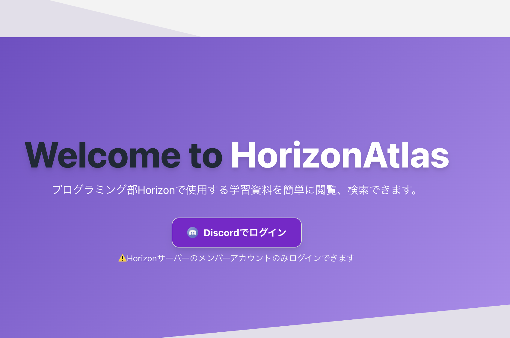

# HorizonAtlas


## 📘 アプリ概要
HorizonAtlas は、龍谷大学プログラミング部 Horizon の学習カリキュラムをまとめたアプリです。
カリキュラムの内容は Notion に書かれており、Notion API を使って読み込み、SSG（静的サイト生成） でビルドしています。
つまり、カリキュラムは Notion上で編集 → このアプリで自動的に公開 される仕組みになっています。

## ✨ 主な機能
- カリキュラムをわかりやすく整理して表示

- キーワード検索 / タグ検索によるカリキュラム検索

- 毎日午前9時にカリキュラムを自動更新

- ユーザーごとの進捗情報を取得・表示

## 🌐 公開URL
👉 [https://ryukoku-horizon.github.io/horizon-atlas](https://ryukoku-horizon.github.io/horizon-atlas)

## 🛠 使用技術
Next.js

## 🚀 始め方
- ビルド
```
npm run build
```

- 起動
```
npm start
```

- アクセス
```
http://localhost:3000/horizon-atlas
```